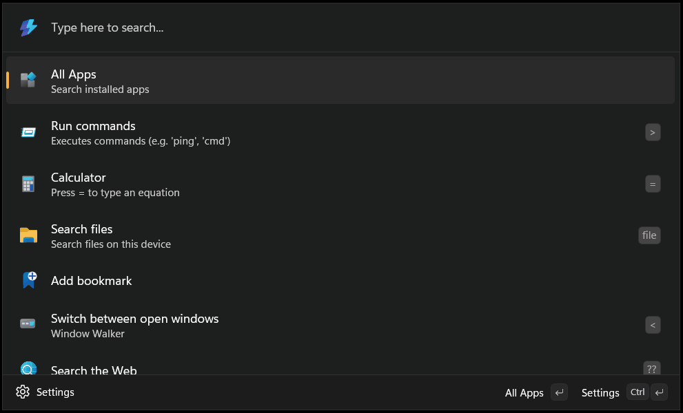

# Project Manager for Command Palette

Effortlessly search and open your VSCode projects directly from the PowerToys Command Palette.

## Feature

This extension integrates with the VSCode [Project Manager](https://marketplace.visualstudio.com/items?itemName=alefragnani.project-manager), allowing you to quickly find and launch any of your managed projects with a simple command.

This repository got inspiration from [Raycast Extension](https://www.raycast.com/MarkusLanger/vscode-project-manager).

## Acknowledgements

- Icon: [Fluent UI System Icons](https://github.com/microsoft/fluentui-system-icons) (MIT License)

